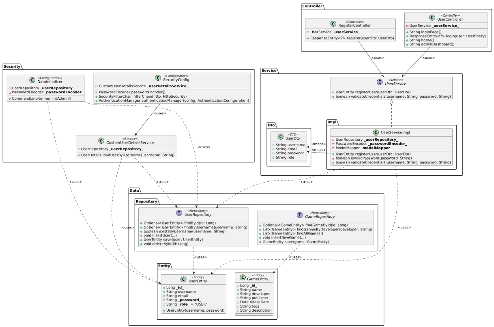

#### PlantUML code:
```plantuml
@startuml

package "Data.Entity" {
  class GameEntity <<Entity>> {
    + Long **_id_**
    + String name
    + String developer
    + String publisher
    + Date relaseDate
    + String tags
    + String description
  }

  class UserEntity <<Entity>> {
    + Long **_id_**
    + String username
    + String email
    + String **_password_**
    + String **_role_** = "USER"
    --
    + UserEntity(username, password)
  }
}


package "Data.Repository" {
  interface GameRepository <<Repository>> {
    + Optional<GameEntity> findGameById(id: Long)
    + List<GameEntity> findGamesByDeveloper(developer: String)
    + List<GameEntity> findAllGames()
    + void insertNewGame(...)
    + GameEntity save(game: GameEntity)
  }

  interface UserRepository <<Repository>> {
    + Optional<UserEntity> findById(id: Long)
    + Optional<UserEntity> findByUsername(username: String)
    + boolean existsByUsername(username: String)
    + void insertUser(...)
    + UserEntity save(user: UserEntity)
    + void deleteById(id: Long)
  }
}


package "Service" {
  interface UserService <<Service>> {
    + UserEntity registerUser(userDto: UserDto)
    + boolean validateCredentials(username: String, password: String)
  }
}

package "Service.Dto" {
  class UserDto <<DTO>> {
    + String username
    + String email
    + String password
    + String role
  }
}

package "Service.Impl" {
  class UserServiceImpl {
    - UserRepository **_userRepository_**
    - PasswordEncoder **_passwordEncoder_**
    - ModelMapper **_modelMapper_**
    --
    + UserEntity registerUser(userDto: UserDto)
    - boolean isValidPassword(password: String)
    + boolean validateCredentials(username: String, password: String)
  }
}

package "Controller" {
  class RegisterController <<Controller>> {
    - UserService **_userService_**
    --
    + ResponseEntity<?> register(userDto: UserDto)
  }

  class UserController <<Controller>> {
    - UserService **_userService_**
    --
    + String loginPage()
    + ResponseEntity<?> login(user: UserEntity)
    + String home()
    + String adminDashboard()
  }
}

package "Security" {
  class CustomUserDetailsService <<Service>> {
    - UserRepository **_userRepository_**
    --
    + UserDetails loadUserByUsername(username: String)
  }

  class SecurityConfig <<Configuration>> {
    - CustomUserDetailsService **_userDetailsService_**
    --
    + PasswordEncoder passwordEncoder()
    + SecurityFilterChain filterChain(http: HttpSecurity)
    + AuthenticationManager authenticationManager(config: AuthenticationConfiguration)
  }

  class DataInitializer <<Configuration>> {
    - UserRepository **_userRepository_**
    - PasswordEncoder **_passwordEncoder_**
    --
    + CommandLineRunner initAdmin()
  }
}


GameRepository ..> GameEntity : <uses>
UserRepository ..> UserEntity : <uses>

UserService <|.. UserServiceImpl
UserServiceImpl .> UserDto : <maps>
UserServiceImpl ..> UserRepository : <uses>
UserServiceImpl ..> UserEntity : <uses>


RegisterController --> UserService : <uses>
UserController --> UserService : <uses>

CustomUserDetailsService ..> UserRepository : <uses>
CustomUserDetailsService ..> UserEntity : <uses>

SecurityConfig --> CustomUserDetailsService : <uses>

DataInitializer ..> UserRepository : <uses>
DataInitializer ..> UserEntity : <uses>
UserServiceImpl --> UserDto : <maps>

@enduml